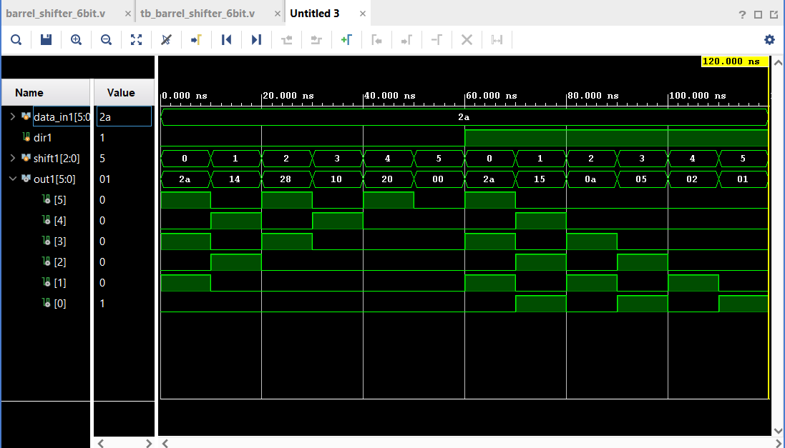
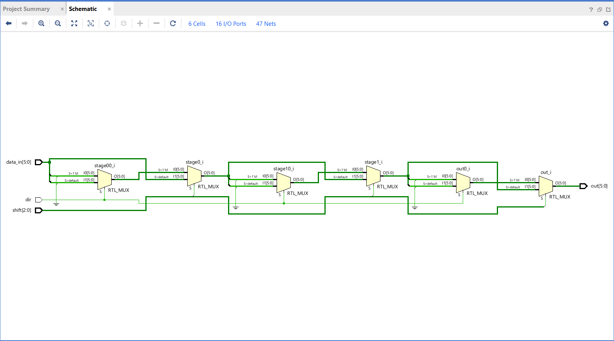

# 6-Bit-Barrel-Shifter

## Introduction
This project presents the design and implementation of a 6-bit barrel shifter using Verilog HDL. A barrel shifter is a combinational logic circuit that can shift or rotate an 'n' bit data word by a maximum of 'n-1' number of bits in a single clock cycle, without any iterative shifting. The objective of this project is to develop a 6-bit barrel shifter capable of shifting data both left and right by 0 to 5 bit positions, controlled by a single direction input. Verilog hardware description language is employed for the implementation. Additionally, a testbench is developed to validate the shifter's behavior across all possible shift amounts and both directions. In conclusion, the 6-bit barrel shifter successfully performs logical left and right shifts, filling vacated bit positions with zeros. The project demonstrates the effectiveness of a staged mux-based architecture in implementing high-speed combinational shifting circuits.

---

## What is a Barrel Shifter
A barrel shifter is a combinational digital circuit that shifts a data word by a specified number of bits in a single operation, without requiring multiple sequential shift operations. This makes it significantly faster than a simple shift register, which would require one clock cycle per bit position shifted. A barrel shifter is widely used in ALUs (Arithmetic Logic Units), microprocessors, and digital signal processing systems. The 6-bit barrel shifter implemented in this project performs logical shifts, meaning vacated bit positions are always filled with zeros. The direction of the shift is controlled by a single input line: asserting it high performs a right shift, while keeping it low performs a left shift.

---

## Design and Implementation

### Barrel Shifter Architecture
The shifter is implemented using a 3-stage cascaded multiplexer architecture, based on the binary implication of the shift amount. Since the shift amount is a 3-bit value, any shift of 0 to 5 positions can be achieved by combining shifts of 1, 2, and 4 positions:

- **Stage 0** — shifts by 1 position, controlled by `shift[0]`
- **Stage 1** — shifts by 2 positions, controlled by `shift[1]`
- **Stage 2** — shifts by 4 positions, controlled by `shift[2]`

Each stage either applies its respective shift or passes the data through unchanged, depending on the corresponding bit of the shift amount. The stages are cascaded so that the output of each stage feeds into the input of the next.

### Tech Stack
Vivado ML Edition - 2025.2 used to implement and simulate the code.

---

## Working
The working of the 6-bit barrel shifter involves cascaded multiplexer stages that collectively achieve any shift amount from 0 to 5. The step-by-step operation is given below:

1. **Input Stage:**
   - The 6-bit input data `data_in` and 3-bit shift amount `shift` are provided along with the direction signal `dir`.
   - When `dir = 1`, the shifter performs a right shift. When `dir = 0`, the shifter performs a left shift.

2. **Stage 0 — Shift by 1:**
   - If `shift[0]` is 1, the data is shifted by 1 position in the specified direction.
   - For a left shift: `{data_in[4:0], 1'b0}` — the data moves left and a zero fills the LSB.
   - For a right shift: `{1'b0, data_in[5:1]}` — the data moves right and a zero fills the MSB.
   - If `shift[0]` is 0, the data passes through unchanged.

3. **Stage 1 — Shift by 2:**
   - Operates on the output of Stage 0.
   - If `shift[1]` is 1, the data is shifted by 2 positions in the specified direction.
   - If `shift[1]` is 0, the data passes through unchanged.

4. **Stage 2 — Shift by 4:**
   - Operates on the output of Stage 1.
   - If `shift[2]` is 1, the data is shifted by 4 positions in the specified direction.
   - If `shift[2]` is 0, the data passes through unchanged as the final output `data_out`.

5. **Combining Stages:**
   - The three stages work together to produce any shift from 0 to 5. For example, a shift of 3 activates Stage 0 (shift by 1) and Stage 1 (shift by 2), combining to give a total shift of 3. This is purely combinational — no clock is required.

---

## Port Description

| Port | Width | Direction | Description |
|------|-------|-----------|-------------|
| `data_in` | 6-bit | Input | The data word to be shifted |
| `shift` | 3-bit | Input | Number of positions to shift (0–5) |
| `dir` | 1-bit | Input | Shift direction: 1 = right, 0 = left |
| `out` | 6-bit | Output | The shifted result |

---

## Results and Discussion
In this project, a 6-bit barrel shifter is implemented using Verilog HDL. The shifter is capable of shifting a 6-bit data word left or right by 0 to 5 positions in a single combinational operation. The direction is controlled by a single input line, and vacated bit positions are always filled with zeros (logical shift). The testbench verified the shifter against all shift amounts (0 to 5) for both left and right directions using the input `101010` (hex: 2A). All output values matched the expected results. The following waveform was observed after simulation:

### Waveform

## RTL Schematic

## Conclusion
In conclusion, the project successfully designed a 6-bit barrel shifter using a 3-stage cascaded multiplexer architecture in Verilog. The shifter efficiently performs logical left and right shifts for all shift amounts from 0 to 5, with the direction controlled by a single input line. The design is entirely combinational, requiring no clock signal, which makes it fast and suitable for use inside ALUs and other time-critical digital systems. The 6-bit barrel shifter holds potential applications in microprocessor datapaths, digital signal processing, and any system requiring fast bit manipulation. The staged mux architecture is easily scalable to wider data widths by adding further stages.

---

## References
- Javatpoint. Verilog Barrel Shifter. Retrieved from https://www.javatpoint.com
- Wikipedia. Barrel Shifter. Retrieved from https://en.wikipedia.org/wiki/Barrel_shifter
- Vivado Design Suite User Guide. Retrieved from https://www.xilinx.com/support/documentation/sw_manuals/xilinx2023_1/ug973-vivado-release-notes-install-license.pdf
- Youtube. Barrel Shifter. Retrieved from https://www.youtube.com/watch?v=yJlvUGyBnFY
